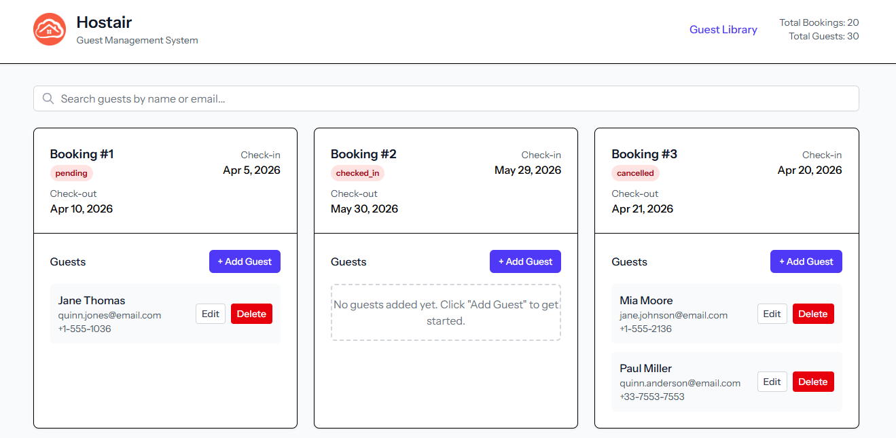
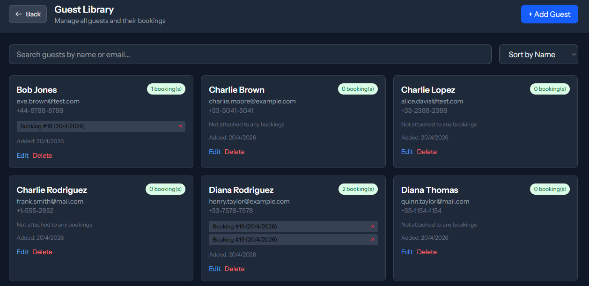

# 🏨 Host Air Guest Manager

A modern web application for managing bookings and guest data for touristic apartments, built with Laravel and Vue.js.


[](https://github.com/guillermopickman-spec/host-air/actions/workflows/laravel.yml)


## 🎨 Screenshots




## ✨ Features

- **Booking Management**: View and manage apartment bookings
- **Guest Management**: Complete CRUD operations for guest data
- **Modern UI**: Beautiful, responsive interface built with Vue 3 and Tailwind CSS
- **Real-time Data**: Live updates through API integration
- **Search & Filter**: Dynamic search functionality for easy data navigation
- **Form Validation**: Client and server-side validation for data integrity

## 🛠️ Tech Stack

### Backend
- **Laravel 10** - PHP framework
- **SQLite** - Database (for development)
- **Eloquent ORM** - Database abstraction
- **Laravel Sanctum** - API authentication

### Frontend
- **Vue 3** - JavaScript framework
- **Pinia** - State management
- **Tailwind CSS** - Styling framework
- **Vite** - Build tool
- **Inertia.js** - SSR support

## 📦 Installation Guide

### Requirements
- **PHP 8.2 or higher** with PDO SQLite extension enabled
- **Composer** - PHP dependency manager
- **Node.js 18+** - JavaScript runtime
- **npm** - Node.js package manager (comes with Node.js)
- **Windows 10 or higher** - Operating system

## 🚀 Quick Start

### Option 1: Full Automated Setup (Windows - Recommended)
For the complete automated experience on Windows:

1. Download or clone the repository
2. Double-click `full-setup.bat`
3. Wait for the setup to complete (it will open your browser automatically)

This script handles everything: dependencies, database setup, server startup, and browser launch.

### Option 2: Manual Windows Setup
If you prefer step-by-step setup:

1. Double-click `setup.bat` to install dependencies and set up the database
2. Double-click `start-dev.bat` to start the development servers

### Option 3: Terminal Setup (All Platforms)
For manual setup or other operating systems:

1. **Clone the repository**
   ```bash
   git clone <repository-url>
   cd host-air
   ```

2. **Install PHP dependencies**
   ```bash
   composer install --ignore-platform-reqs
   ```

3. **Install JavaScript dependencies**
   ```bash
   npm install
   ```

4. **Environment setup**
   ```bash
   cp .env.example .env
   php artisan key:generate
   ```

5. **Database setup**
   ```bash
   php artisan migrate:fresh --seed --force
   npm run build
   ```

6. **Start the application**
   ```bash
   composer run dev
   ```

7. **Access the application**
   Open your browser and navigate to `http://localhost:8000`

**Note:** This project is tested and working on Windows. The automated scripts are optimized for Windows environments.

## 📖 Usage

### Managing Bookings
- View all bookings in a clean grid layout
- Each booking card displays key information including associated guests
- Click on a booking to expand and manage guest details

### Guest Management
- **Create**: Add new guests to any booking
- **Read**: View guest information within booking cards
- **Update**: Edit existing guest details
- **Delete**: Remove guests from bookings

### Search Functionality
- Use the search bar to filter bookings by guest name
- Real-time filtering as you type
- Clear search to view all bookings

## 🏗️ Project Structure

```
host-air/
├── app/
│   ├── Http/Controllers/     # API controllers
│   └── Models/               # Eloquent models
├── database/
│   ├── migrations/           # Database schema
│   ├── factories/            # Model factories
│   └── seeds/               # Database seeders
├── resources/
│   ├── js/                  # Vue.js frontend
│   │   ├── components/      # Vue components
│   │   ├── pages/          # Page components
│   │   └── stores/         # Pinia stores
│   └── views/              # Blade templates
├── routes/
│   ├── api.php            # API routes
│   └── web.php            # Web routes
└── tests/                 # Test files
```

## 🧪 Testing

### Unit Tests
```bash
php artisan test
```

### Feature Tests
```bash
php artisan test --testsuite=Feature
```

### Browser Tests
```bash
php artisan test --testsuite=Browser
```

## 🔧 Development

### Running Migrations
```bash
php artisan migrate
```

### Seeding Database
```bash
php artisan db:seed
```

### Quick Setup Script
For a complete setup including database seeding with test data:
```bash
# Windows
setup.bat

# Or manually:
composer install
npm install
php artisan key:generate
php artisan migrate
php artisan db:seed
npm run build
php artisan serve
```

The seeding process will populate your database with:
- 1 test user
- 100 sample bookings with various check-in/check-out dates and statuses
- 10 sample guests with complete contact information

### Generate Dummy Data
```bash
php artisan initialize-bookings
```

### Frontend Development
```bash
npm run dev    # Development server
npm run build  # Production build
npm run lint   # Linting
```

## 📋 API Endpoints

### Bookings
- `GET /api/bookings` - Get all bookings with guests
- `POST /api/bookings` - Create new booking
- `PUT /api/bookings/{id}` - Update booking
- `DELETE /api/bookings/{id}` - Delete booking

### Guests
- `GET /api/guests` - Get all guests
- `POST /api/guests` - Create new guest
- `PUT /api/guests/{id}` - Update guest
- `DELETE /api/guests/{id}` - Delete guest

## 🤝 Contributing

1. Fork the repository
2. Create your feature branch (`git checkout -b feature/amazing-feature`)
3. Commit your changes (`git commit -m 'Add amazing feature'`)
4. Push to the branch (`git push origin feature/amazing-feature`)
5. Open a Pull Request

## 📄 License

This project is open source and available under the [MIT License](LICENSE).

## 🙏 Acknowledgments

- Built with [Laravel](https://laravel.com)
- Frontend powered by [Vue.js](https://vuejs.org)
- Styled with [Tailwind CSS](https://tailwindcss.com)
- Database management with [SQLite](https://sqlite.org)

---

**Made with ❤️ for managing touristic apartment bookings**
